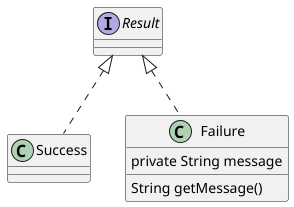
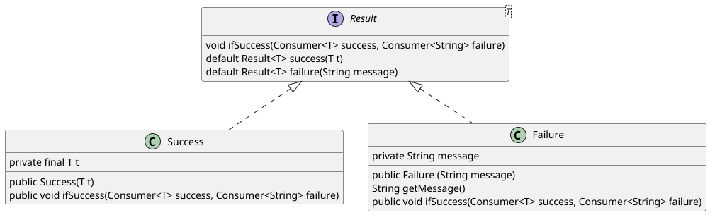
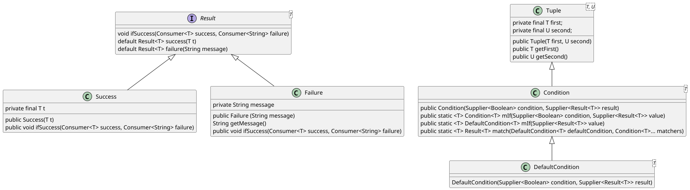

# Java: From Imperative to Functional - A Complete Use Case

Java, as anybody knows, isn't a functional language. It doesn't allow for *functional
programming*. But once having said that, it's important to mention that there isn't
any general agreed definition of what the *functional programming* is.

In simple terms, the *functional programming* is a programming paradigm which 
consists in programming *with functions*. In the real world, *functions* are 
primarily mathematics concepts defining relations between a *domain* and a *codomain*.
But in traditional Java, they are methods. 

Well, when I'm saying that, in Java, functions are methods, what I mean is that, 
functions may be represented by methods, provided that they satisfy the following
conditions:

  - They don't mutate anything outside their scope, meaning that no internal mutation may be visible from outside.
  - They don't mutate their arguments.
  - They don't throw exceptions.
  - They return a value.
  - They always return the same result when called with the same arguments.

Methods satisfying the rules above are called *functional methods*. However, they
still cannot be considered as the equivalent of functions in functional programming.
As a matter of fact, what they're missing is the ability to be passed as arguments
or to be returned as result values. Consequently, *functional methods* cannot be
composed. One can compose *functional method* applications, but not *functional
methods* themselves, because they belong to classes.

Things have dramatically changed since 2014, with Java 8, which brought a powerful
new syntactic improvement: the *functional interfaces*. Starting from this moment, 
functions have become a first class Java citizen, thanks to the `java.util.function.Function`
class and to the *lambda expressions*. However, this major improvement doesn't 
make Java a functional programming language. Like its ancestors SmallTalk and C++,
it stays an *imperative* programming language, while becoming *functional friendly*.

*Imperative programming* is another programming paradigm where programs are composed
of elements that *do* things, as opposed to functional programs that are composed
of elements that *are* things. Doing something means an initial state, a set of
transitions and an end state. Hence, imperative programs consist in a series of
mutations, from the initial to the final state, separated by conditions testing.
As opposed to the imperative style, functional-style programs don't *do* things.
For example, a function implementing the addition of two integers, let's say 2 
and 3, doesn't *make* 5, but *is* 5. Consequently, each time you encounter 2 + 3
you can replace it by this function. 

Can we do that in Java ? Well, sometimes we can but, very often, it requires to
change the program outcome. If our function, that we want to use to replace the 
expression, doesn't have any other effect than returning the result, then we can,
but this isn't generally the case because we systematically need to mutate 
variables, print out something, write to databases, raise exceptions etc. These
are called *side effects*.

So, functional programming means writing programs without *side effects*. And 
while we certainly can do that in Java for simple cases as the one in the example,
the question is: "can we do it in Java enterprise grade applications ?"

This article tries to answer this question. And, for doing that, I considered a
simple, yet realistic, use case.

## A Simple Yet Realistic Use Case

The simple, yet realistic, case considered here, in order to illustrate my point,
is the one of an SMS notifications service. You may find the project here: https://github.com/nicolasduminil/sms-notifications.
Once you've cloned it, you'll find several implementations of the case, each one making
the object of a separated module in the Maven multi-module project. We start with
`sms-notification-initial` which is the most traditional imperative implementation
and, iteration by iteration, from `i1` to `i5`, we successively refactor it, until
getting the most functional style implementation.

The code below shows our initial, full imperative, implementation of the SMS 
notification service.

    public class Notification
    {
      private static final PhoneNumberUtil phoneNumberUtil = PhoneNumberUtil.getInstance();

      public void sendNotification(String phoneNumber, String region, String message)
      {
        if (isValid (phoneNumber, region))
        {
          SmsService sms = new SmsService();
          sms.send(phoneNumber, message);
        }
        else
          throw new IllegalArgumentException("### Invalid phone number format: %s"
            .formatted(phoneNumber));
      }

      private static boolean isValid(String number, String defaultRegion)
      {
        try
        {
          Phonenumber.PhoneNumber phoneNumber = phoneNumberUtil
           .parse(number, defaultRegion);
          return phoneNumberUtil.isValidNumber(phoneNumber);
        }
        catch (NumberParseException e)
        {
          return false;
        }
      }
      ...
    }

As you can see, our notification service uses the `com.google.i18n.phonenumbers.PhoneNumberUtil`
class to check the validity of the phone number and its associated region. Then,
it sends the SMS notification, on the behalf of the `SmsService` class, or it 
raises an `IllegalArgumentException`. The `SmsService` itself is just a fictive
one, which only logs a message.

You can test this simple service as shown below:

    $ git clone https://github.com/nicolasduminil/sms-notifications.git
    $ cd sms-notifications
    $ mvn test

There are a couple of JUnit tests in this module that will succeed.

The code above is purely imperative. The `sendNotification(...)` method doesn't
return anything and it mixes data processing with side effects, like sending an
SMS or throwing an exception. Additionally, it isn't possible to test the phone
number validation in isolation, without the mentioned side effects.

So, in order to improve this code, one of the first thing we can make is to 
separate validation from side effects.

## Separating side effects

In this first iteration, that you can find in the module `sms-notifications-i1`,
we separate the side effects from the validation process, as follows:

    public class Notification
    {
      private static final PhoneNumberUtil phoneNumberUtil = PhoneNumberUtil.getInstance();

      public final BiFunction<String, String, Boolean> phoneNumberValidator = (number, region) -> {
        try
        {
          Phonenumber.PhoneNumber phoneNumber = phoneNumberUtil.parse(number, region);
          return phoneNumberUtil.isValidNumber(phoneNumber);
        }
        catch (NumberParseException e)
        {
          return false;
        }
      };

      public void sendNotification(String phoneNumber, String region, String message)
      {
        if (phoneNumberValidator.apply (phoneNumber, region))
        {
          SmsService sms = new SmsService();
          sms.send(phoneNumber, message);
        }
        else
          throw new IllegalArgumentException("### Invalid phone number format: %s".formatted(phoneNumber));
      }
    }

Here, by isolating the phone number validation in the `phoneNumberValidator` 
function, we separate the validation operation from its side effects. Exceptions
are still thrown by the Google API and we cannot change anything here, but they
are caught and the appropriate result is returned.

If you look in the `TestNotifications` class of this module, you may see tests 
like:

    ...
    assertTrue(notification.phoneNumberValidator
      .apply("+33615229808", "FR"), "Salut !");
    ...
    assertFalse(notification.phoneNumberValidator
      .apply("+33615229808123", "FR"), "Salut !");
    ...

that weren't possible before. The 2nd test in the code above fails because the 
phone number passed as an input argument isn't valid in the given region (too 
long). But there is no difference between the case of an invalid phone number 
and the one of an invalid region. Or the one where the phone number is null or 
empty. To address this point, we can define a component able to handle in 
a more specific way the validation result.

## A more functional Result

This component may be found in the `sms-notifications-i2` module and its class 
diagram is shown below:

The class diagram above shows the Result interface implemented by the `Success` and
`Failure` classes. Now, the new version of our `Notification` is as follows:

    public class Notification
    {
      private static final PhoneNumberUtil phoneNumberUtil = PhoneNumberUtil.getInstance();

      public static BiFunction<String, String, Result> phoneNumberValidator = (number, region) ->
      {
        if (number == null)
          return new Failure("### The phone number can not be null");
        else if (number.length() == 0)
          return new Failure("### The phone number can not be empty");
        else
          try
          {
            if (phoneNumberUtil.isValidNumber(phoneNumberUtil.parse(number, region)))
              return new Success();
            else
              return new Failure("### The phone number %s is not valid for region %s".formatted(number, region));
          }
          catch (NumberParseException e)
          {
            return new Failure("### Unexpected exception while parsing the phone number %s".formatted(number));
          }
      };

      public void sendNotification(String phoneNumber, String region, String message)
      {
        Result result = phoneNumberValidator.apply (phoneNumber, region);
        if (result instanceof Success)
        {
          SmsService sms = new SmsService();
          sms.send(phoneNumber, message);
        }
        else
          throw new IllegalArgumentException("### Invalid phone number format: %s".formatted(phoneNumber));
      }
    }

Running the JUnit tests against this new version will produce the expected output
in the mentioned cases, where the phone numbers or the regions are null or empty.
But this isn't yet satisfactory as the method `sendNotification(...)` doesn't 
return any result and, consequently, it is hardly testable. But the worst is 
that it throws exceptions, which is a side effect.

So, how could we get rid of these drawbacks ? One of the solutions would be,
instead of sending the SMS or throwing an exception, to return an action that does
whatever we need to do in each case. For example, to send the SMS if the validation
is successful or to log an error message otherwise. And this could be easily done,
thanks to lambda functions.

## Abstracting the actions

Let's switch now to the `sms-notifications-i3` module.

    public class Notification
    {
      private static final Logger LOG = Logger.getLogger(Notification.class.getName());
      private static final PhoneNumberUtil phoneNumberUtil = PhoneNumberUtil.getInstance();

      public static BiFunction<String, String, Result> phoneNumberValidator = (number, region) ->
      {
        try
        {
          return number == null
            ? new Failure("### The phone number can not be null")
            : number.length() == 0
              ? new Failure("### The phone number can not be empty")
              : phoneNumberUtil.isValidNumber(phoneNumberUtil.parse(number, region))
                ? new Success()
                : new Failure("### The phone number %s is not valid for region %s"
                  .formatted(number, region));
        }
        catch (NumberParseException e)
        {
          return new Failure ("### The phone number %s is not valid for region %s"
            .formatted(number, region));
        }
      };

      public Runnable sendNotification(String phoneNumber, String region, String message)
      {
        Result result = phoneNumberValidator.apply(phoneNumber, region);
        return (result instanceof Success)
          ? () -> sendSms(phoneNumber, message)
          : () -> logError(((Failure) result).getMessage());
      }

      private void sendSms(String phoneNumber, String message)
      {
        new SmsService().send(phoneNumber, message);
      }

      private void logError(String message)
      {
        LOG.info("### Error: %s".formatted(message));
      }
    }

We took advantage of this new refactoring to simplify the `phoneNumberValidator(...)`
function by replacing the `if..then.else..` structures with the more concise 
ternary operator based notation. But more important, our `sendNotification(...)`
method doesn't return any more `void` but a `Runnable` which, depending on the 
validation success or failure, is a call to either the `sendSms(...)` method, 
or to the `logError(...)` one. And here we're touching at one of the most advanced
functionalities of the functional programming: the ability to abstract actions 
and to handle them as lambda functions which could be used as input arguments 
or returned as result values.

Now the `sendNotidfication(...)` method is almost functional as it starts 
to be closer and closer to a pure function. It is also much easier testable as 
it allows now successful test like:

    ...
    Runnable action = notification.sendNotification("+33615229808", "FR", "Test message");
    assertNotNull(action);
    assertDoesNotThrow(() -> action.run());
    ...

or unsuccessful ones like:

    ...
    Runnable action = notification.sendNotification("+33615229808123", "FR", "Test message");
    assertNotNull(action);
    action.run();
    assertTrue(logHandler.hasLoggedMessage("### Error: The phone number +33615229808123 is not valid for region FR"));
    ...

However, using `instanceof` to check whether the result is a success or a failure
is an antipattern widely not advisable. Another problem is the `sendNotification(...)`
method dependency on `sendSms(...)` or `logError(...)`. What if we want to invoke 
different actions ? Or no action at all, just to compose the result with some 
other function ? Well, in this case we need to decouple the `sendNotification(...)`
method from its success or failure actions.

## Decoupling functional methods from their actions

In order to achieve this goal we need to refactor the `Result` hierarchy such that
to be able to bind actions to its `Success` and `Failure` implementations. Then 
our class diagram becomes as follows:

And here the listing of our new version of `Notification`, refactored as required:

    public class Notification
    {
      private static final Logger LOG = Logger.getLogger(Notification.class.getName());
      private static final PhoneNumberUtil phoneNumberUtil = PhoneNumberUtil.getInstance();

      static BiFunction<String, String, Result<String>> phoneNumberValidator = (number, region) ->
      {
        try
        {
          return number == null
            ? new Failure("### The phone number can not be null")
            : number.length() == 0
              ? new Failure("### The phone number can not be empty")
              : phoneNumberUtil.isValidNumber(phoneNumberUtil.parse(number, region))
                ? new Success(number)
                : new Failure("### The phone number %s is not valid for region %s"
                  .formatted(number, region));
        }
        catch (NumberParseException e)
        {
          return new Failure("### Unexpected exception %s"
            .formatted(e.getMessage()));
        }
      };

      public void sendNotification (String phoneNumber, String region, String message)
      {
        phoneNumberValidator.apply(phoneNumber, region).ifSuccess(success, failure);
      }

      static Consumer<String> success = to -> sendSms(to, ">>> SMS sent to %s"
        .formatted(to));

      static Consumer<String> failure = msg -> logError(msg);

      static void logError(String message)
      {
        LOG.info("### Error: %s".formatted(message));
      }

      static void sendSms(String phoneNumber, String message)
      {
        new SmsService().send(phoneNumber, message);
      }
    }

In this new version, the function `phoneNumberValidator(...)` returns a parameterized
`Result<String>`, the `Success` class holds a value of type `T`, while the `Failure`
one holds a `String`. Two functions are now defined, one for success and the 
other one for failure. They are both bound to actions using the `ifSuccess(...)`
method, which hasn't probably the right name.

During the previous refactoring, we have already replaced the `if..then..else` 
structure with the ternary operator. This operator is considered functional as 
it returns a value and it doesn't have side effects. This is as opposed to the 
`if..then..else` controls which, in general, have side effects. Accordingly, 
programs having several `if..then..else` structures should be refactored, not 
only because they aren't functional, but also because they are hardly readable 
and maintainable.

This isn't, of course, our case here, however, given that the ternary operator
can be also made non-functional, let's try to get rid of it as well.

## Abstracting control structures

Can we do that, can we completely remove the conditional structures or operators
from our code ? In order to verify that, let's start by implenting th following
class:

    public class Condition<T> extends Tuple<Supplier<Boolean>, Supplier<Result<T>>>
    {
      public Condition(Supplier<Boolean> condition, Supplier<Result<T>> result)
      {
        super(condition, result);
      }

      public static <T> Condition<T> when(Supplier<Boolean> condition, Supplier<Result<T>> value)
      {
        return new Condition<>(condition, value);
      }

      public static <T> DefaultCondition<T> when(Supplier<Result<T>> value)
      {
        return new DefaultCondition<>(() -> true, value);
      }

      @SafeVarargs
      public static <T> Result<T> select(DefaultCondition<T> defaultCondition, Condition<T>... matchers)
      {
        for (Condition<T> aCondition : matchers)
          if (aCondition.getFirst().get()) return aCondition.getSecond().get();
        return defaultCondition.getSecond().get();
      }
    }

This class extends `Tuple`, a base class that holds a pair of generics and which
is here parameterized with a `Suplier<Boolean>` representing a condition, and 
a `Supplier<Result<T>>` holding the result of the condition evaluation.

Then two methods, named `when`, are provided. The 1st one defines the normal case
with a condition and a resulting boolean value. The 2nd one defines a default case
represented by the `DefaultCondition` subclass.

    public class DefaultCondition<T> extends Condition<T>
    {
      public DefaultCondition(Supplier<Boolean> condition, Supplier<Result<T>> result)
      {
        super(condition, result);
      }
    }

The `select(...)` method selects a condition. The figure below shows the complete
class diagram:

And here is the new version of the `Notification` class:

    public class Notification
    {
      ...
      public BiFunction<String, String, Result<String>> phoneNumberValidator = (number, region) ->
      {
        return select(
          when(() -> new Success<>(number)),
          when(() -> number == null, () -> new Failure<>("### The phone number cannot be null.")),
          when(() -> number.length() == 0, () -> new Failure<>("### The phone number cannot not be empty.")),
          when(() ->
          {
            try
            {
              return !phoneNumberUtil.isValidNumber(phoneNumberUtil.parse(number, region));
            }
            catch (NumberParseException e)
            {
              return false;
            }
          }, () -> new Failure<>("### The phone number %s is not for region %s"
            .formatted(number, region))));
      };

      public void sendNotification(String phoneNumber, String region, String message)
      {
        phoneNumberValidator.apply(phoneNumber, region).ifSuccess(success, failure);
      }
      ...
    }

This way we have removed the long ternary operator expression from the previous
version, by which we have replaced the `if..then.else` control structure. Our 
implementation starts looking more as a functional style one.

However, we still have this ugly `try..catch` structure and, unfortunately, 
there is not much to do here. Java is, inherently, an imperative programming 
language, built on the `try..catch` concept. And we're using an external service,
the Google phone number validator, which throws exceptions. This exceptions should
either be caught, and that's ugly, or thrown, and then we have side effects.

So yes, we need to admit it, weu cannot completely eliminate the `try..catch` 
when calling exception-throwing services. The `try..catch` will always exist 
somewhere in the codebase when interfacing with imperative APIs.

## The reality of functional programming in Java

Pure functional languages like Haskell don't have exceptions. They use types 
like `Maybe` or `Either` for error handling. Java's ecosystem is built on exceptions,
so we must bridge between the imperative and the functional world.

The best we can do is isolate the imperative exception handling to specific 
boundary methods and try to keep the core business logic purely functional.So,
our `phoneNumberValidator(...)` method will always need that `try..catchè somewhere,
but we can:

  - Move it to a dedicated method (cleaner separation).
  - Keep the main validation logic functional.
  - Minimize the imperative surface area.

This is the pragmatic reality of functional programming in Java: we achieve 
functional style where possible while acknowledging that complete purity isn't 
feasible when working with exception-based APIs.
